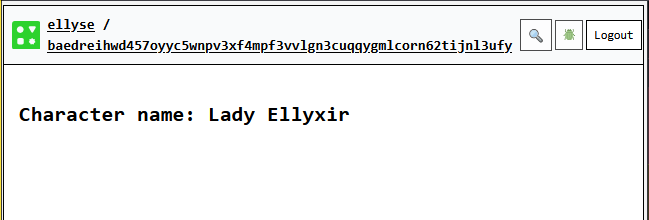

# WIP
This is work in progress.
Idea is to introduce state tracking which is done by Cells.
We'll use the open source SRD 5e character sheet as a vehicle to teach all these concept since a character sheet is all about state, derived stats and displaying information. See [OGL](https://www.dndbeyond.com/srd)

TODO
* DONE Explain what Cells are.
* DONE How to create a cell via cell() - skip other methods for now
* DONE How set set a value
* DONE How to display a value
* How to derive a value (simple direct derive)
* How to derive from two state inputs
* How to read a value

## State and Cells

You'll be learning how to handle state within the Common Tools runtime.
The most direct way to store state is via `Cells`.
Cells store and access data, they do this via their set() and get() methods.  
There are many ways to create cells and we'll get to all of them, but for now, we'll start with the `cell<T>()` function available in Recipes.
You've already used this in {ref}`calling_llm`

Creating a cell is quite easy!
```{code-block} typescript
export default recipe("state test", () => {
  const characterName = cell<string>("");
}
```
Here, we have created a cell with a type argument of `string`,
and its intial value is the empty string.

Let's now set `characterName` to something a bit more interesting.

```{code-block} typescript
export default recipe("state test", () => {
  const characterName = cell<string>("");
  characterName.set("Lady Ellyxir");
}
```

Let's not judge the author's choice of names.
We can now display the cell within the [UI] section of the recipe:
```{code-block} typescript
/// <cts-enable />
import {
  cell,
  h,
  recipe,
  UI,
} from "commontools";

export default recipe("state test", () => {
  const characterName = cell<string>("");
  characterName.set("Lady Ellyxir");
  return {
    [UI]: (
      <div>
        <h2>Character name: {characterName}</h2>
      </div>
    ),
  };
});
```
The `{characterName}` snippet creates a reactive node behind the scenes. This means the rendered character name is updated whenever the cell changes.

You can now deploy the code. See the section {ref}`deploy_charms` for how to do this.

It'll look a bit like this:

**Figure**: Character Name set

## Credits
We used the opensource SRD 5.1 for character sheet information.
See [SRD 5.1](https://www.dndbeyond.com/srd).
It is licensed under
Creative Commons Attribution 4.0 International (“CC-BY-4.0”)

