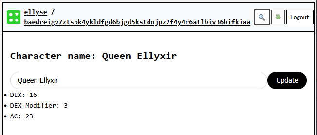

# Modifying State

## TODO
* Modify existing state
  * user input button rolling dice
  * DONE text input changing name
* more complex state types (object)
  * make stats an objects
* How to derive from two state inputs
* How to read a value

In the last section, we learned how to create state via cells and also
how to create derived states. Our example was using
a SRD 5e character sheet.
Now we are going to learn how to modify state once we've set
its initial value.

Let's start with changing the character's name.
We'll need to add a text input field in the `[UI]` section.
We can't just use regular HTML components.
The Common Tools runtime has its own JSX components to
to make sure data is protected and not accessed by
other scripts.

```{code-block} typescript
:label: state_ac_lift
:linenos: false
:emphasize-lines: 
    <common-send-message
      name="Update"
      placeholder="Update Name"
      // we need to fill out the event listener attribute below
      // onmessagesend= 
    />
```

If you deploy this update, you'll see an input field, but nothing happens
when you enter data. As the comments indicate, we
need to fill out code for the onmessagesend JSX event listener.

This is when we learn about `handler`.
A `handler` is a Common Tools runtime component that, like its name
suggests, handles events.
The JSX event listener (such as `onmessagesend` in our code) will call
our handler to handle the event emitted by the JSX component.

Handlers in Common Tools have a specific signature:

```{code-block} typescript
handler<EventType, ArgsType>(handlerFunction)
```

The `handler` function takes:
- Two **type** parameters:
  - `EventType`: defines the event data structure
  - `ArgsType`: defines the arguments/context that you want to pass to the handler
- One **argument**: we pass in a function which receives:
  - `event` (matches EventType) as its first parameter
  - `args` (matches ArgsType) as its second parameter

:::{admonition} Advanced note
The `handler` function returns a factory that you call with your actual arguments to create the event handler. This factory pattern allows the handler to bind specific values from your recipe while still receiving events from the UI components.
:::

We'll start by writing our handler which takes the event emitted by the
`<common-send-message>` component. This component emits a CustomEvent with the structure `{detail: {message: string}}`,
where `message` contains the text the user entered.
The handler will also take in the
`characterName` cell. It will simply set the cell with the new name
from the event.

```{code-block} typescript
:label: state_handler_updatename
:linenos: false
:emphasize-lines:
const updateName = handler<
  { detail: { message: string } },
  { characterName: Cell<string> }
>(
  (event, { characterName }) => {
    console.log("Updating character name to:", event.detail.message);
    characterName.set(event.detail.message);
  }
);
```
Note that `characterName` was passed in as a `Cell`. We created it via the
`cell()` function, which returns us a `Cell`. It's important to
mark reactive components as `Cell` so that we can call methods such
as `set()` on them.

Now we can attach this handler to our input component:

```{code-block} typescript
:label: state_handler_attach
:linenos: false
:emphasize-lines:
<common-send-message
  name="Update"
  placeholder="Update Name"
  onmessagesend={updateName({ characterName })}
/>
```

If you deploy this code, you should see something like:

**Figure:** Updating your character's name 

:::{dropdown} View complete code
:animate: fade-in

```{literalinclude} ./code/state_02.tsx
:language: typescript
```
:::
